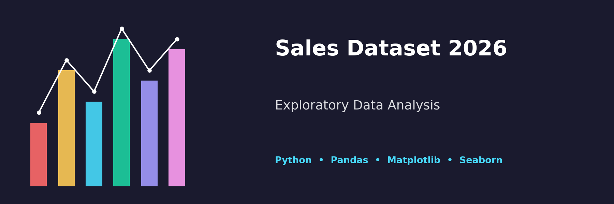

# Aishwarya Mohan | Data Engineering Portfolio

Hands-on projects in **Python data analysis, Azure Data Factory and Azure Databricks**.



This portfolio brings together a sales-analysis notebook and documented Azure exercises covering data movement, orchestration, transformation, REST API ingestion and incremental loading.

## Start here

| Project | What it demonstrates | Explore |
| --- | --- | --- |
| Sales data analysis | Cleaning 1,000 orders, handling missing values, aggregation and seven visualizations | [Notebook and guide](Data-Analysis-Project/) |
| ADF Copy Activity | Data movement with Azure Data Factory | [Project documentation](Microsoft-Azure-Projects/Copy-Activity/) |
| ADF Control Flow | Triggers, variables, metadata, loops and conditional file routing | [Two exercises](Microsoft-Azure-Projects/Control-Flow/) |
| ADF Data Flows | Derived columns, column selection, filtering, sorting and joins | [Transformation walkthroughs](Microsoft-Azure-Projects/Data-Flows/) |
| Databricks and ADLS Gen2 | Reading cloud files and retrieving secrets through Azure Key Vault | [Integration walkthrough](Microsoft-Azure-Projects/Databricks/) |
| API fetching | Google News and Shopping API ingestion into ADLS Gen2 | [REST API pipelines](Microsoft-Azure-Projects/API-Fetching/) |
| Incremental load | Watermark-based SQL ingestion using lookups, Copy Data and a stored procedure | [Incremental loading walkthrough](Microsoft-Azure-Projects/Incremental-Load/) |

## Repository structure

```text
Data-Engineer/
├── Data-Analysis-Project/
│   ├── README.md
│   ├── Sales-Data-Analysis.ipynb
│   ├── salesdataset.csv
│   └── requirements.txt
├── Microsoft-Azure-Projects/
│   ├── Copy-Activity/
│   ├── Control-Flow/
│   ├── Data-Flows/
│   ├── Databricks/
│   ├── API-Fetching/
│   └── Incremental-Load/
├── README.md
└── project_banner.png
```

## Skills demonstrated

**Analysis:** Python, Pandas, Matplotlib, Seaborn, data cleaning, aggregation and exploratory analysis.

**Azure:** Data Factory, Blob Storage, Azure SQL Database, Databricks, ADLS Gen2, Key Vault, REST API ingestion and watermark-based incremental loading.

For a quick review, start with the sales notebook, then explore the conditional routing, API ingestion and incremental-load walkthroughs. Each Azure folder contains a guide linking to the original PDF evidence.

## Scope

The Python project includes executable analysis and its dataset. The Azure projects contain learning exercises documented with configuration screenshots and run results; exported pipelines and deployment templates are not included.

## Connect

[LinkedIn](https://www.linkedin.com/in/aishwaryamohan1121/) · [GitHub](https://github.com/aishwaryamohan325-lang)
